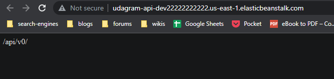

# App Dependencies

[**Backend:**](http://udagram-api-dev22222222222.us-east-1.elasticbeanstalk.com/)
- Elastic Beanstalk
- Amazon RDS running postgres
- Node
- jsonwebtoken
- sequelize
- pg
- typescript

[**Frontend:**](http://udagram-bucket-927116460261.s3-website-us-east-1.amazonaws.com/home)
- S3
- angular
- typescript
- ionic
- jasmine

## Screenshots

## Frontend

## Backend

## Elastic Beanstalk Health

## RDS

## S3
