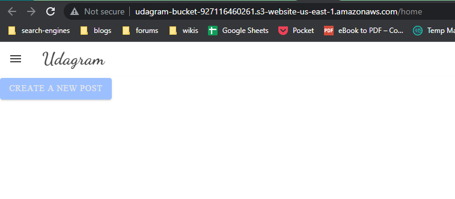
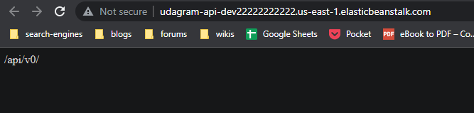
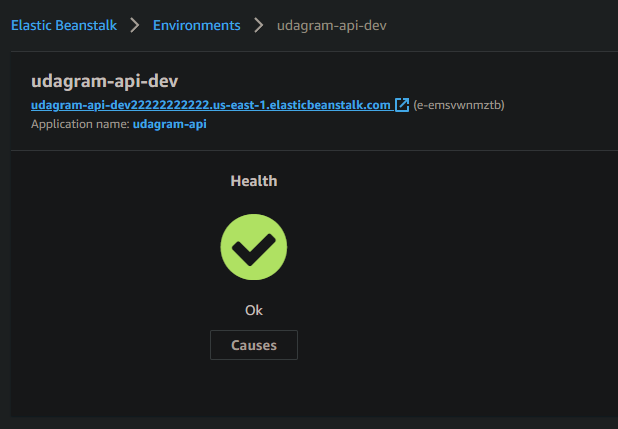
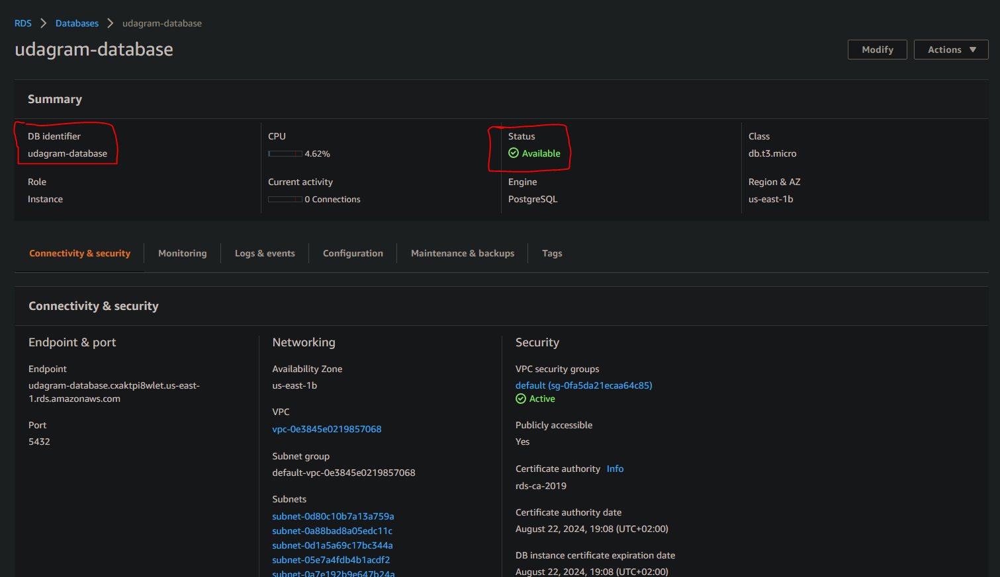
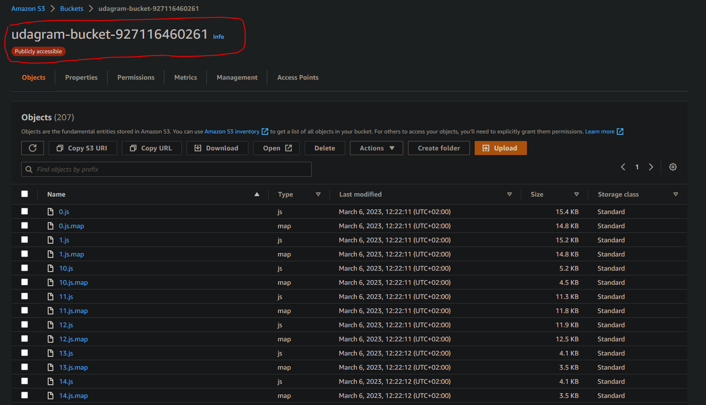

# App Documentation

## URLS:
- [**FRONTEND**](http://udagram-bucket-927116460261.s3-website-us-east-1.amazonaws.com/home)
- [**BACKEND**](http://udagram-api-dev22222222222.us-east-1.elasticbeanstalk.com/)

---

## [**App Dependencies**](./app-dependencies.md)

---

## [**Infrastructure**](./infrastructure.md)

---

## [**Pipeline**](pipeline.md)

---

### Screenshots

#### Frontend

#### Backend

#### Elastic Beanstalk Health

#### Elastic Beanstalk Health

### Elastic Beanstalk Health

