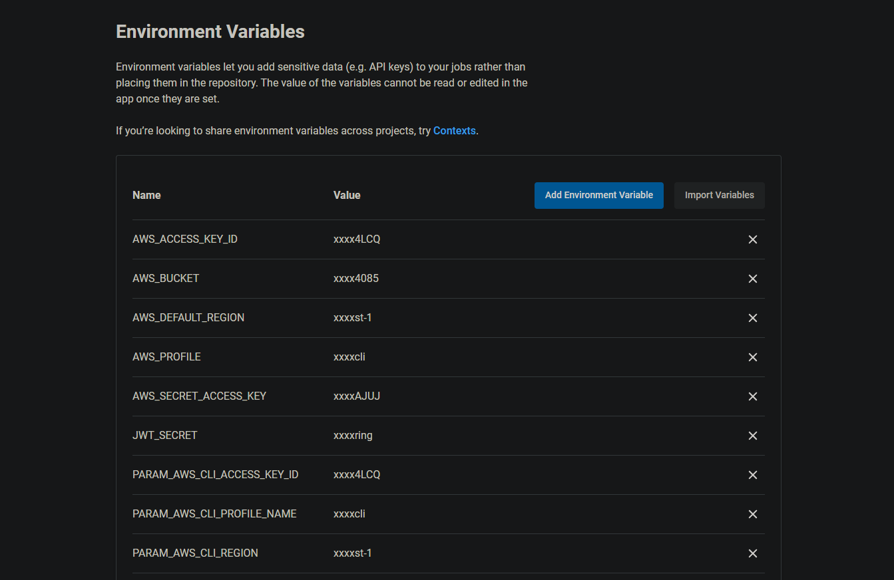

# Pipeline

```bash
circleci
├── Build
│   ├── set env variables       
│   ├── install node js
│   ├── checkout code
│   ├── Install AWS CLI v2
│   ├── Setup Elastic Beanstalk CLI
│   ├── Configure AWS AccessKeyID
│   ├── Frontend Lint
│   ├── Frontend build
│   └── API build
├── Approve
├── Deploy
│   ├── set env variables       
│   ├── install node js
│   ├── checkout code
│   ├── Build API
│   ├── Deploy API
│   ├── Build Front
└───└── Deploy Frontend
```

## workflow


## secrets
